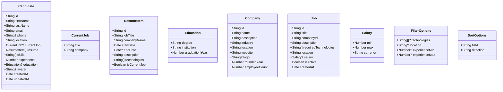
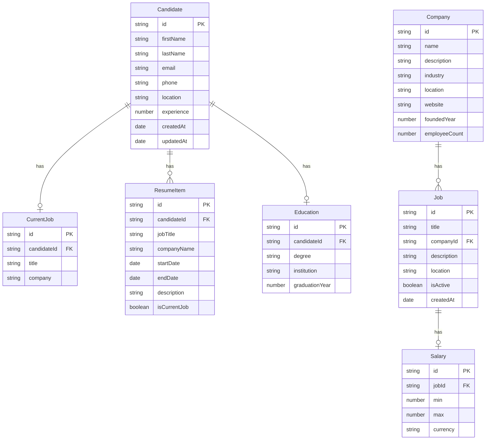
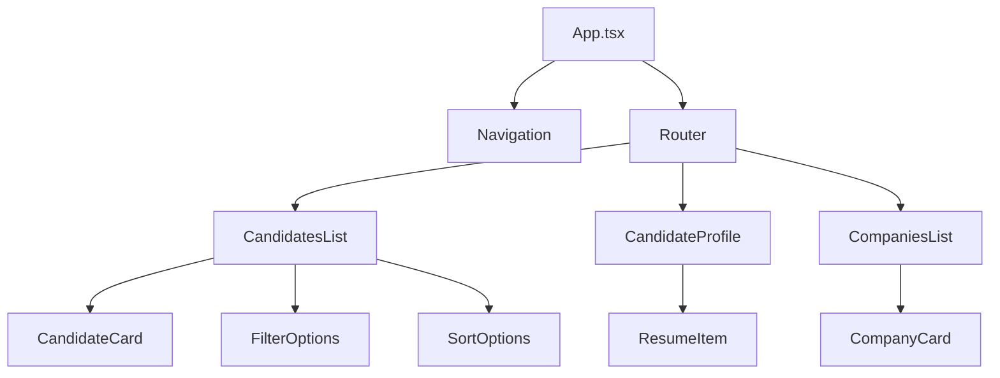
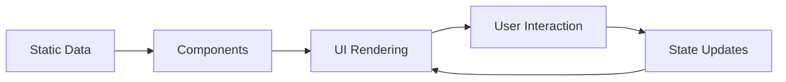

# Talent Management System - UML Class Diagram

## Key Relationships Diagram

## Key Relationships

1. **Candidate → ResumeItem**: One-to-many (a candidate has multiple resume items)
2. **Candidate → CurrentJob**: One-to-one (optional - a candidate may have a current job)
3. **Candidate → Education**: One-to-one (optional - a candidate may have education info)
4. **Company → Job**: One-to-many (a company can post multiple jobs)
5. **Job → Salary**: One-to-one (optional - a job may have salary information)
6. **Job → Company**: Many-to-one (each job belongs to one company)

## Component Architecture

## Data Flow

## Notes

- **Data Source**: Currently uses static mock data in `src/data/` folder
- **State Management**: Local React state with hooks
- **Routing**: Client-side routing with React Router
- **Styling**: Tailwind CSS utility classes
- **Type Safety**: Full TypeScript implementation with interfaces
